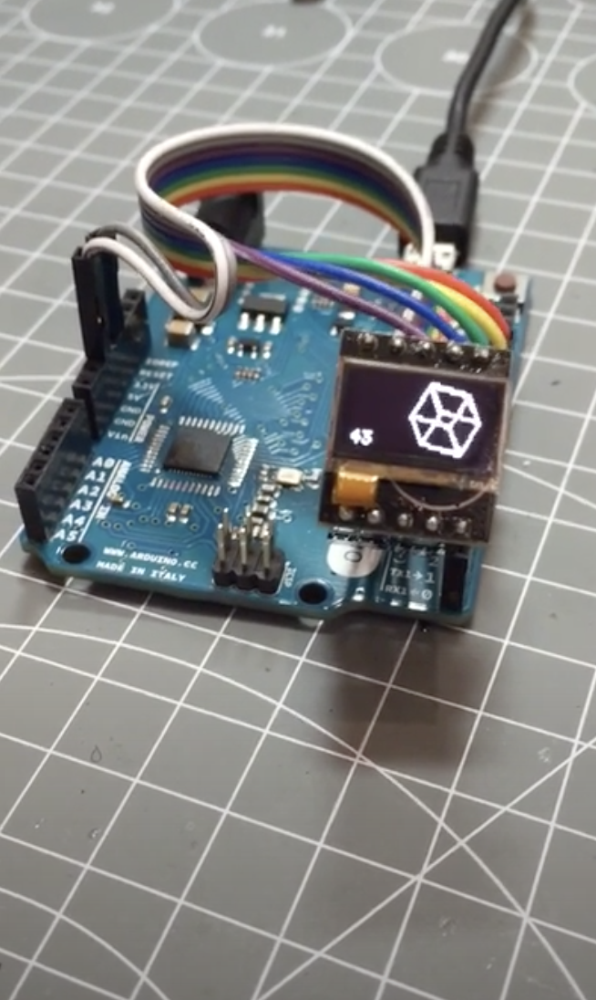

This is 3D object rotation and 2D projection example on Arduino.
It uses 64x48 oled display with SSD1306 controller.
Driving to oled display, Adafruit_SSD1306(this is not original library 64x48 support added by https://github.com/mcauser/Adafruit_SSD1306) and Adafruit_GFX libraries are used.

Demo video is here: https://www.youtube.com/watch?v=3_ugKHDYY54

